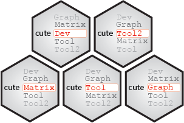

# The cute project 

## Why the cute project?
 
[R](https://www.r-project.org) is a permissive programming language: it will 'try to work' in many situations and returns something, when other programming languages would have returned an error. This advantage partly explains its success, but it comes with several problems which could soften reproducibility aspects:
- Non intuitive behaviors (example of the [`sample()`](http://127.0.0.1:25073/library/base/html/sample.html) function when the input is a single integer).
- Lack of control of the arguments of functions (example with the [`range()`](https://bugs.r-project.org/show_bug.cgi?id=17654) function, or the presence of the `...` argument in functions).
- Lack of explicit error messages.
  
The cute project gathers R functions with a similar encoding that better controls their expected behavior.

## Features of the cute functions

- Explicit error messages, including the name of the function and corresponding package returning the error.
- Same checking backbone before the 'main' code of the function, divided in several subsections, detailed below.
- Presence in local R library folders of all the functions and corresponding packages used in the code.
- Argument checking: 
    - Values for arguments with no default values
    - Expected class, type, mode, length, restricted values panel, kind of numeric values in addityion to the distinction between 'integer' and 'double' (proportion only, Inf values authorized, negative values authorized).
    - NA authorized.
    - Only NA authorized.
    - NULL value authorized.
    - Expected structure of complex objects like data frames and lists (forbidden colum names, etc.).
- Argument `...` not authorized.
- Seeding of the random number generator by protecting potential seeding in the global environment
- All warning messages added in error messages.

## cute Packages

- [cuteDev](https://github.com/yushiHn/cuteDev): R function development.
- [cuteMatrix](https://github.com/yushiHn/cuteMatrix): matrix handling
- [cuteGraph](https://github.com/yushiHn/cuteGraph): classical graphic handling
- [cuteTool](https://github.com/yushiHn/cuteTool): basic tools
- [cuteTool2](https://github.com/yushiHn/cuteTool2): sophisticated tools
